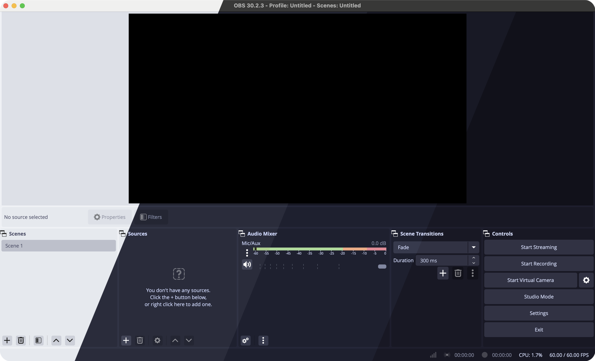
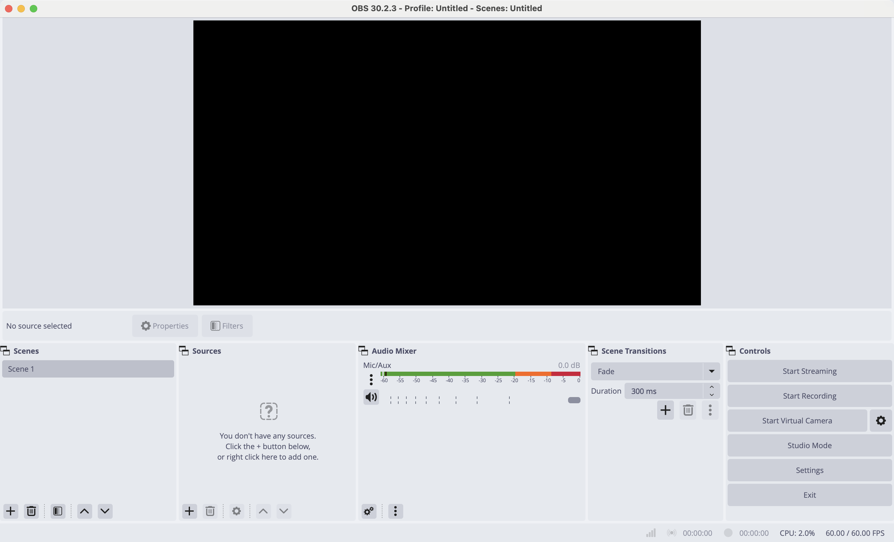
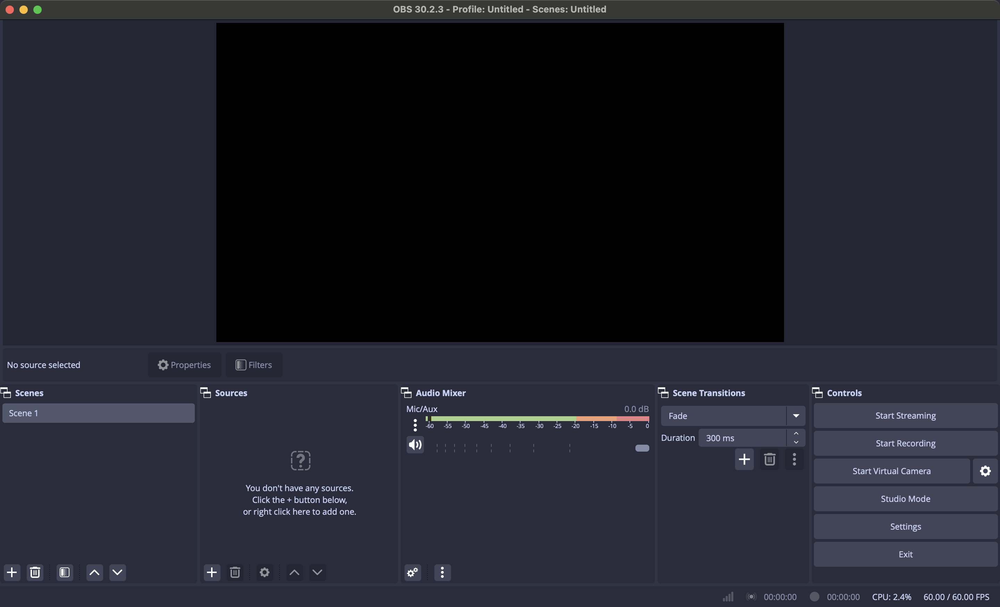
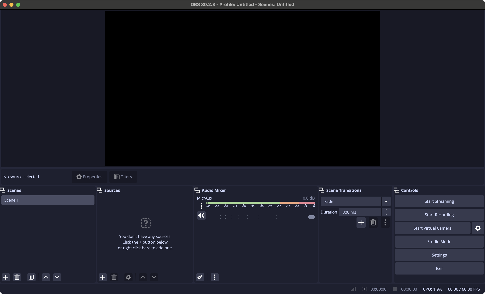

<h3 align="center">
	 
	
	Catppuccin for <a href="https://github.com/obsproject/obs-studio">OBS Studio</a>
	
</h3>

	
	
	

	

## Previews

🌻 Latte

🪴 Frappé

🌺 Macchiato

🌿 Mocha

## Usage

1. Clone this repository locally.
2. Copy the contents of [`themes/`](./themes/) into the OBS themes directory for your operating system: see [obsproject/obs-studio Wiki - Installing custom themes](https://github.com/obsproject/obs-studio/wiki/Custom-Themes#installing-custom-themes).
3. Open OBS > **Settings** > **Appearance**.
4. Select "Catppuccin" in the **Theme** dropdown, and select your preferred flavor in the **Style** dropdown.

## 💝 Thanks to

- [OBS Studio](https://github.com/obsproject/obs-studio/tree/master/UI/data/themes)
- [Xurdejl](https://github.com/Xurdejl)

&nbsp;

	

	Copyright &copy; 2021-present <a href="https://github.com/catppuccin" target="_blank">Catppuccin Org</a>

	

