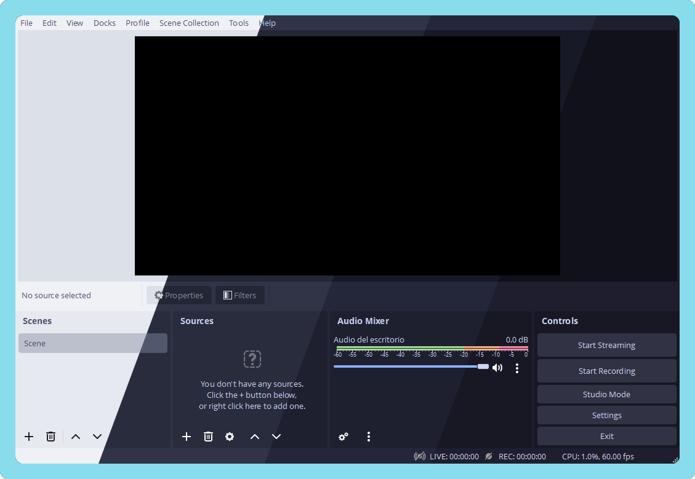

<h3 align="center">
	 
	
	Catppuccin for <a href="https://github.com/obsproject/obs-studio">OBS Studio</a>
	
</h3>

	
	
	

	

## Usage

1. [Clone](https://github.com/catppuccin/obs/archive/refs/heads/main.zip) this repository locally.

2. Install the theme using one of the following options:

  - **Option 1:** Use the provided scripts
    - **Windows**: Right-click the `install (Windows).ps1` script and then select "Run with PowerShell".
    - **macOS** or **Linux**:
      - Open a terminal window and navigate to the folder where the script is located.
      - Run the following command: `./install.sh`
        
  - **Option 2:** Install the theme manually
    - Copy the contents of the *themes* folder into:
        - **Windows**: WinKey+R > %APPDATA%\obs-studio\themes\
        - **macOS**: Cmd+Shift+G > ~/Library/Application Support/obs-studio/themes/
        - **Linux**: ~/.config/obs-studio/themes/

      (You may have to create the themes directory yourself.)

3. Open OBS settings and select one of the flavours from the *Themes* dropdown.

## 💝 Thanks to

- [OBS Studio](https://github.com/obsproject/obs-studio/tree/master/UI/data/themes)
- [Xurdejl](https://github.com/Xurdejl)

&nbsp;

	

	Copyright &copy; 2021-present <a href="https://github.com/catppuccin" target="_blank">Catppuccin Org</a>

	

