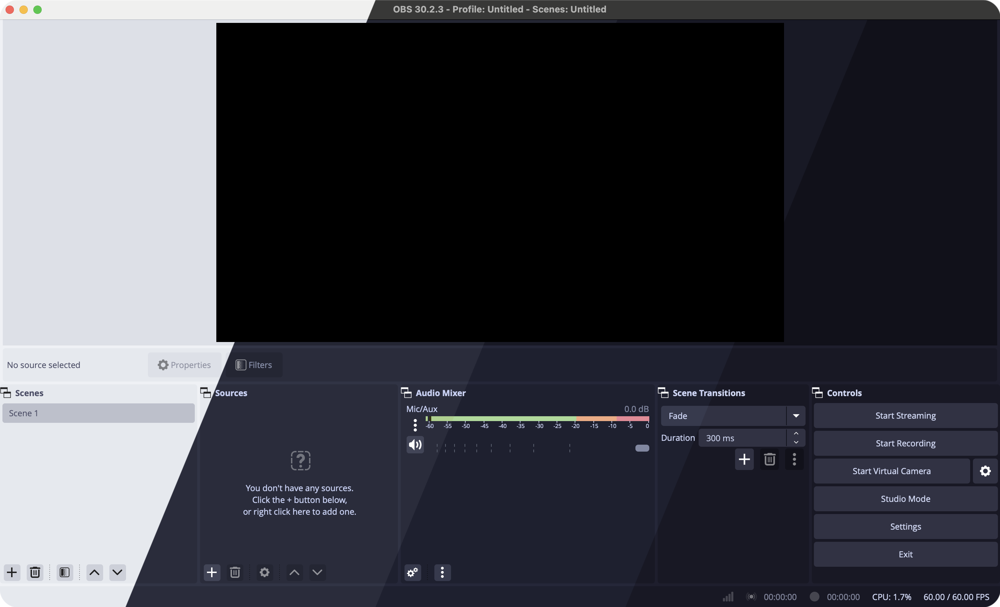
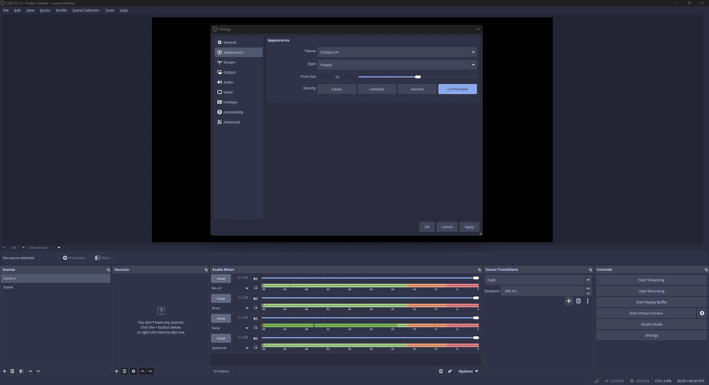
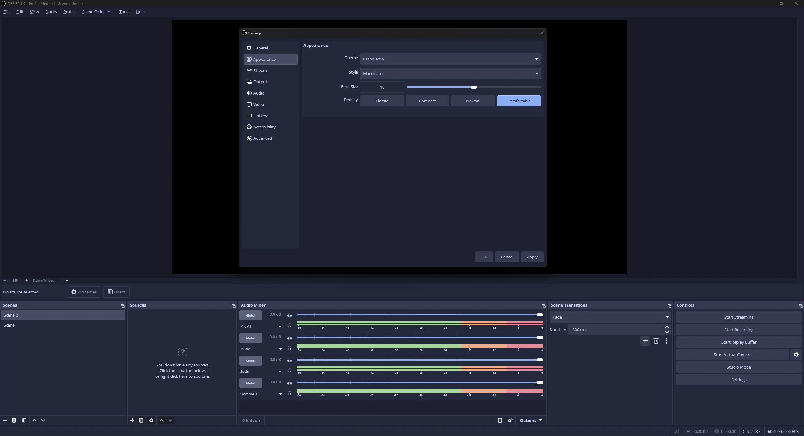
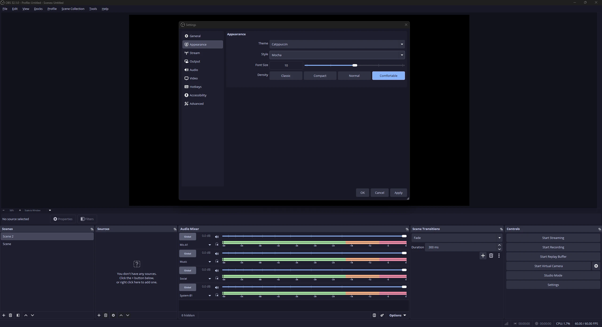

<h3 align="center">
	<br/>
	
	Catppuccin for <a href="https://github.com/obsproject/obs-studio">OBS Studio</a>
	
</h3>

<p align="center">
	<a href="https://github.com/catppuccin/obs/stargazers"></a>
	<a href="https://github.com/catppuccin/obs/issues"></a>
	<a href="https://github.com/catppuccin/obs/contributors"></a>
</p>

<p align="center">
	
</p>

## Previews

<details>
<summary>🌻 Latte</summary>

</details>
<details>
<summary>🪴 Frappé</summary>

</details>
<details>
<summary>🌺 Macchiato</summary>

</details>
<details>
<summary>🌿 Mocha</summary>

</details>

## Usage

> [!IMPORTANT]
> Requires OBS Studio 30.2 or later. For older versions see the
> [`pre-30.2.0`](https://github.com/catppuccin/obs/tree/pre-30.2.0) tag.

1. Download `catppuccin-obs.zip` from the [latest release](https://github.com/catppuccin/obs/releases/latest) and extract it.
2. Copy all extracted files into the OBS themes directory for your OS:
   see [Installing custom themes](https://github.com/obsproject/obs-studio/wiki/Custom-Themes#installing-custom-themes).
3. Open OBS > **Settings** > **Appearance**.
4. Select **Catppuccin** in the **Theme** dropdown, then pick your flavor in the **Style** dropdown.

## Development

Themes are generated from [`obs.tera`](./obs.tera) using [Whiskers](https://github.com/catppuccin/whiskers).

```sh
# Build all .ovt flavor files
just build

# Build and install directly into your OBS themes directory
just install
```

To enable live reloading while editing, add `AutoReload=true` under `[Appearance]` in `user.ini`.

## 💝 Thanks to

- [OBS Studio](https://github.com/obsproject/obs-studio/tree/master/UI/data/themes)
- [Xurdejl](https://github.com/Xurdejl)

&nbsp;

<p align="center">
	
</p>

<p align="center">
	Copyright &copy; 2021-present <a href="https://github.com/catppuccin" target="_blank">Catppuccin Org</a>
</p>

<p align="center">
	<a href="https://github.com/catppuccin/catppuccin/blob/main/LICENSE"></a>
</p>
